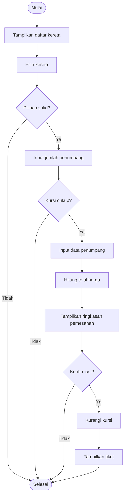

# 🧾 Final Project – Sistem Pemesanan Tiket Kereta (C++)

## 1️⃣ Pseudocode Sistem Pemesanan Tiket Kereta

```text
PROGRAM TiketKereta_Cpp

DEKLARASI:
  struct Kereta {
    string kodeKereta
    string namaKereta
    string asal
    string tujuan
    string tanggal
    string jam
    string kelas
    int harga
    int kursiTersedia
  }

  struct Penumpang {
    string nama
    string nik
  }

  Kereta daftarKereta[5]
  Penumpang dataPenumpang[20]

  int pilihanKereta
  int jumlahPenumpang
  int totalHarga
  char konfirmasi

ALGORITMA:
  TAMPILKAN "=== SISTEM PEMESANAN TIKET KERETA ==="

  INISIALISASI data daftarKereta

  TAMPILKAN daftarKereta
  INPUT pilihanKereta

  JIKA pilihanKereta tidak valid:
    TAMPILKAN "Pilihan tidak valid"
    SELESAI

  INPUT jumlahPenumpang

  JIKA jumlahPenumpang > kursiTersedia:
    TAMPILKAN "Kursi tidak mencukupi"
    SELESAI

  UNTUK i ← 1 SAMPAI jumlahPenumpang:
    INPUT dataPenumpang[i].nama
    INPUT dataPenumpang[i].nik

  totalHarga ← jumlahPenumpang × hargaKereta

  TAMPILKAN ringkasan pemesanan

  TAMPILKAN "Konfirmasi pemesanan (Y/T)"
  INPUT konfirmasi

  JIKA konfirmasi = 'Y':
    kurangi kursiTersedia
    TAMPILKAN "Pembayaran berhasil"
    TAMPILKAN tiket
  LAIN:
    TAMPILKAN "Pemesanan dibatalkan"

SELESAI
```

---

## 2️⃣ Flowchart Sistem Pemesanan Tiket Kereta



---

## 3️⃣ Struktur Program C++

```text
1. Struct Kereta
   - Menyimpan data kereta (nama, rute, jadwal, harga, kursi)

2. Struct Penumpang
   - Menyimpan data penumpang (nama, NIK)

3. Fungsi:
   - tampilkanKereta()
   - inputPenumpang()
   - hitungTotalHarga()
   - cetakTiket()

4. Fungsi main()
   - Mengatur alur utama program
```

---

## 4️⃣ Contoh Output Program

```text
=== SISTEM PEMESANAN TIKET KERETA ===

1. Argo Bromo | Jakarta - Surabaya | 07:00 | Rp350000
2. Taksaka    | Jakarta - Yogyakarta | 08:00 | Rp300000

Pilih kereta: 1
Jumlah penumpang: 2

Masukkan nama penumpang 1: Andi
Masukkan NIK: 1234567890
Masukkan nama penumpang 2: Budi
Masukkan NIK: 0987654321

Total Harga: Rp700000
Konfirmasi pemesanan (Y/T): Y

=== TIKET KERETA ===
Kereta   : Argo Bromo
Rute     : Jakarta - Surabaya
Tanggal  : 12-12-2025
Jam      : 07:00
Penumpang:
- Andi
- Budi
Status   : LUNAS
```
